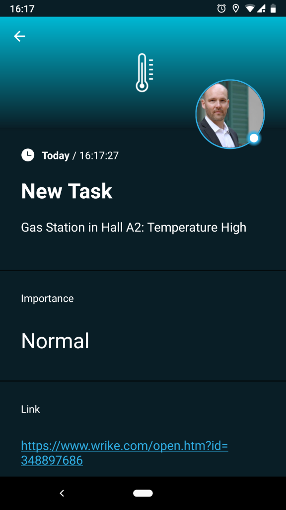
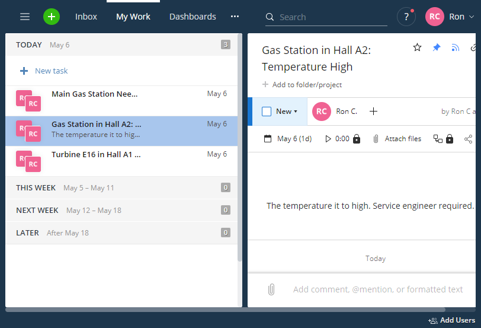
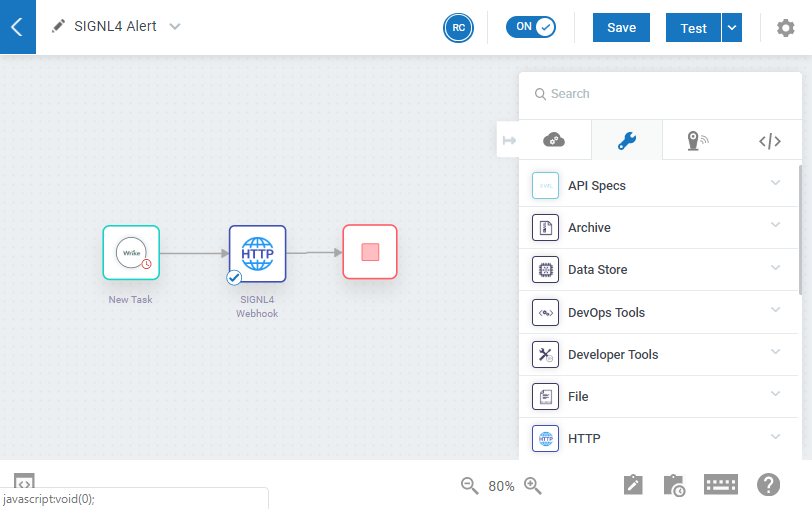
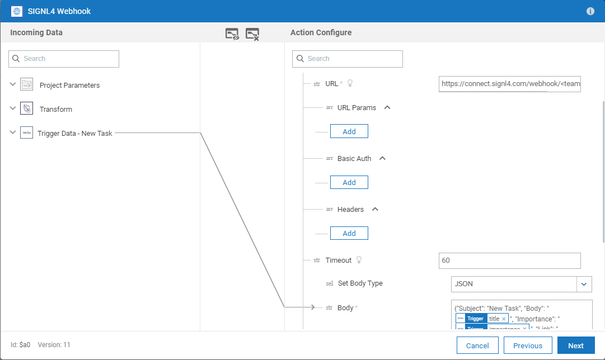
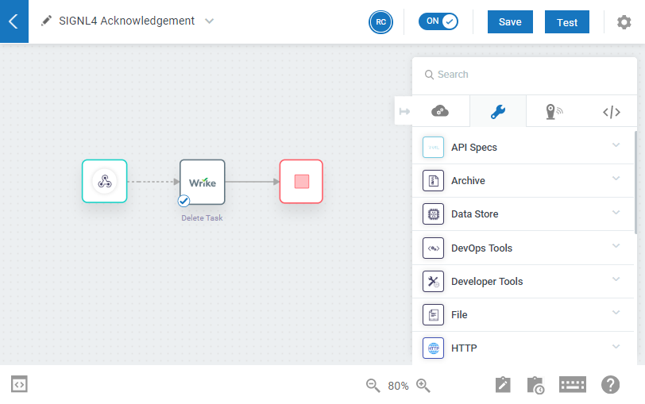
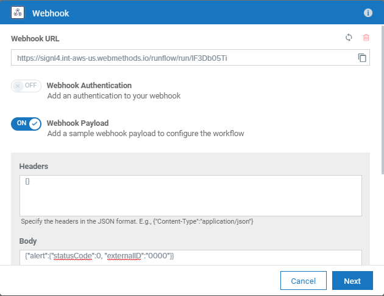
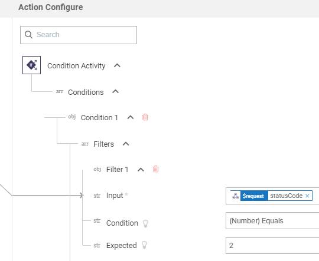

# Integrating SIGNL4 with Software AG Cloud webMethods.io

Mobile alerting with tracking & escalation for Software AG Cloud webMethods.io.

## Why SIGNL4

Software AG Cloud webMethods.io is a platform for integrating virtually any system or application, including Web applications, IoT devices, mainframe legacy systems and even custom code. Pairing webMethods.io with SIGNL4 can enhance your daily operations with an extension to your mobile team in the field or on the shop floor.



## How it Works

All it takes to pair webMethods.io and SIGNL4 is a Webhook action within the webMethods.io workflow. This action then calls the SIGNL4 webhook to trigger the alert.

## Integration Capabilities

- Service engineers alerted via mobile push, text and voice
- Staff can acknowledge and take ownership for critical events that occur
- Alerts are escalated in case of no response
- Communicate within an alert to address a particular problem
- Alert on critical device states
- Two-way integration to interact or set the device state

## Scenarios

- IT operations
- Service Management
- Industrial IoT
- Industry 4.0
- IoT Service Alerting
- IoT Device Management
- IT, Manufacturing, Utility, Oil and Gas, Agriculture, etc.

## How To Integrate

### Integrating SIGNL4 with Software AG Cloud webMethods.io

In webMethods.io there are various triggers and predefined recipes for automating all kinds of tasks. In our example we use the project management tool Write (https://www.wrike.com) as a trigger.



Each time a new task pops up in Wrike we want to notify our service team.

SIGNL4 is a mobile alert notification app for powerful alerting, alert management and mobile assignment of work items. Get the app at https://www.signl4.com.

As a bonus we also show how to delete the task in Wrike as soon as the SIGNL4 user acknowledges the alert.

### Prerequisites

A SIGNL4 (www.signl4.com) account

An account at Software AG Cloud webMethods.io (if you do not have an account yet you can get a free trial account here: https://www.softwareag.cloud/site/product/webmethods-api.html#/)

#### Integration Steps

1. Create the Workflow to Send a SIGNL4 Alert

In the webMethods.io console you can create a new workflow. In our case we have Wrike as a trigger. But of course you can use any trigger appropriate for you.



The action in our workflow is the Webhook. This one sends the HTTP request to SIGNL4 in order to trigger the alert.



In the Webhook you configure the URL of the inbound SIGNL4 webhook including team-secret. And you specify the JSON payload. Here you can add parameters from your trigger, in our case the title of the Wrike task and the task ID.

Now you can test it and as a result you should get a SIGNL4 alert for each new task you create in Write.

2. Create the Workflow to Handle SIGNL4 Acknowledgements

When a team member acknowledges the alert we want to delete (for the sake of simplicity) the task in Wrike.

Therefore we create a second workflow in webMethods.io.



The trigger is a Webhook and the URL is the one you would need to specify in your SIGNL4 portal under Development -> Webhook. This webhook is called for each status change of an alert. In the Webhook trigger the URL is generated for you automatically. In the body you can specify the format of the outbound webhook of SIGNL4 (https://www.signl4.com/outbound-webhooks).

In our case we just need the statusCode and the externalID.

So, the body looks like follow:
```
{"alert":{"statusCode":0, "externalID":"0000"}}
```



You can also specify a condition in order to trigger the workflow for acknowledgements only. In order to do so you can right-click the line from the trigger to the next action and specify the condition to be statusCode == 2.



In the Wrike action you just need to delete your task and in order to delete the right one you need to specify the original task ID. This one is available in externalID.

That is it. When you now acknowledge an alert the respective task in Wrike is deleted.

You can find a sample script in GitHub:
https://github.com/signl4/signl4-integration-webmethods-io
